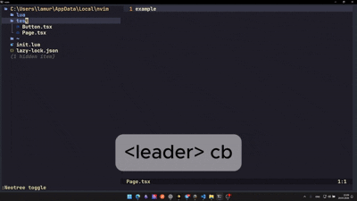

# autobarrel.nvim

Simple Neovim plugin for generating and updating barrel files like `index.ts`.

<p align="center">
  
</p>

## Features

- Create barrel for selected directory
- Update barrel for selected directory
- Auto-update nearest parent barrel on file save
- Neo-tree integration

## Installation (lazy.nvim)

```lua
{
  "da-b1rmuda/autobarrel.nvim",
  dependencies = {
    "nvim-neo-tree/neo-tree.nvim",
  },
  config = function()
    require("autobarrel").setup({
      barrel_name = "index.ts",
      auto_update = true,
      update_only_nearest = true,
      notify = false,
      neo_tree = {
        enabled = true,
      },
    })
  end,
}
```

## Commands

- `:BarrelCreate [dir]`
- `:BarrelUpdate [dir]`

If `dir` is omitted, current buffer directory is used.

## Neo-tree integration

Add to your neo-tree config:

```lua
require("neo-tree").setup({
  commands = {
    barrel_create = function(state)
      require("autobarrel.integrations.neotree").create_from_state(state)
    end,
    barrel_update = function(state)
      require("autobarrel.integrations.neotree").update_from_state(state)
    end,
  },
  filesystem = {
    window = {
      mappings = {
        ["<leader>bc"] = "barrel_create",
        ["<leader>bu"] = "barrel_update",
      },
    },
  },
})
```
